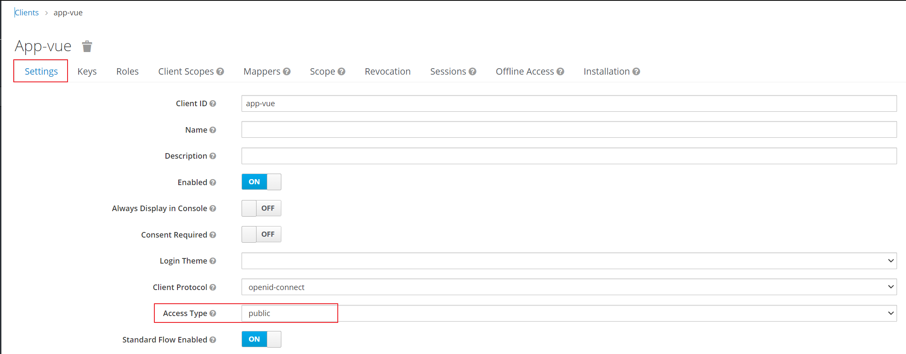
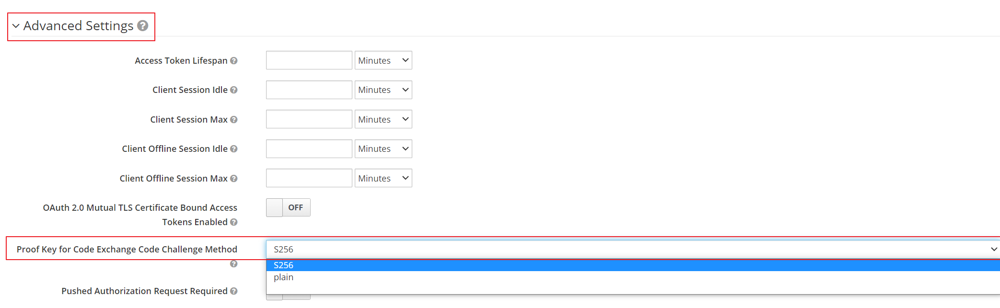

### vue(FE) + .NET Web API(BE) + Keycloak(SSO)
---

##### Deploy infrastructure services using Docker.
- postgresql docker [docker-compose.yml](./docker/postgresql/docker-compose.yml)
- quay.io/keycloak docker [docker-compose.yml](./docker/keycloak/docker-compose.yml)

---
##### Vue3 + vite framework
```
npm create vite@latest
npm install keycloak-js
```
- `keycloak-js`에서 token 교환 방식이 authorization code의 public type으로 진행이 된다.
  - client secret을 사용하지 않고 token을 교환한다.
    - keycloak-js 라이브러리 [client secret 로직 삭제](https://github.com/keycloak/keycloak/commit/913056b2b2d39707347a39dddb7bdad69fe47cc3)
- [PKCE 설정](#pkce-설정)을 통해 token 교환 시 보안성을 높일 수 있다.
---

##### PKCE 설정
###### Keycloak
- `realm -> clients -> client id 선택`
- `Settings -> Access Type을 public으로 선택`
  - 
- `Settings -> Advanced Settings -> Proof Key for Code Exchange Code Challenge Method를 S256으로 선택`
  - 
###### keycloak.js
```javascript 
// init method 호출 시 pkceMethod 지정
keycloak.init({ onLoad: 'login-required', pkceMethod: 'S256' })
```
